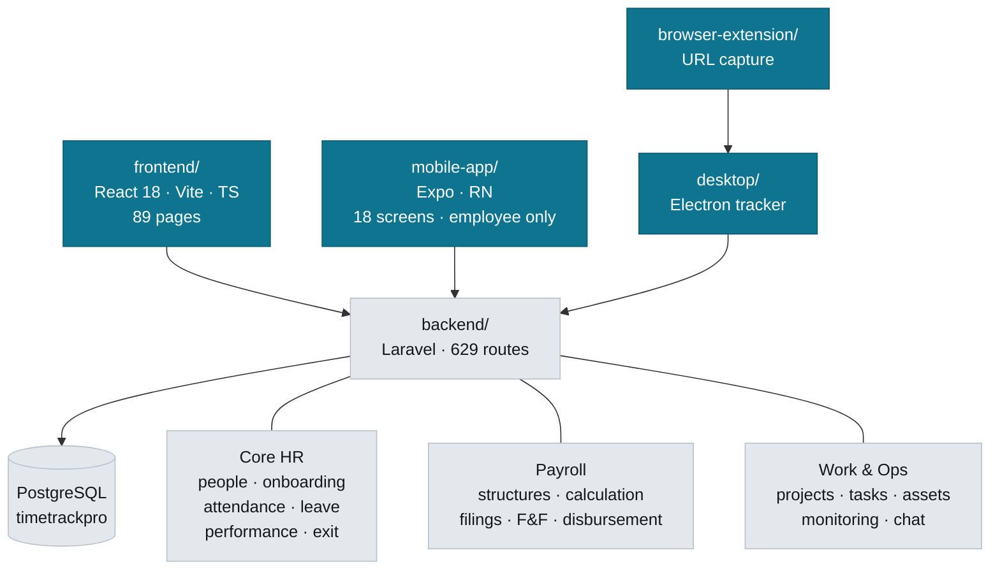

# CareVance HRMS

Multi-tenant HR and payroll platform for the Indian market. One Laravel API serving four clients.

---

## Navigation map



## Where things live

| Looking for | Go to |
|---|---|
| An API endpoint | `backend/routes/api/protected/*.php` — split by domain (`payroll.php`, `lifecycle.php`, `users.php`) |
| Business logic | `backend/app/Services/` — 82 services; controllers stay thin-ish |
| A web screen | `frontend/src/pages/` · shared UI in `components/` · domain UI in `features/` |
| API client calls | `frontend/src/services/api.ts` (large — one export per domain) |
| A mobile screen | `mobile-app/app/` (expo-router) · API in `mobile-app/src/api/endpoints.ts` |
| Tracker/screenshot logic | `desktop/main.cjs` |

### Commands

```bash
# backend  (cwd: backend/)
php artisan test                      # 2496 passed, 1 skipped, 0 failed (24 Aug 2026)
php artisan test --filter=SomeTest
php artisan migrate

# frontend (cwd: frontend/)
npm run dev                           # :5173
npx vitest run                        # 1375 tests across 140 files, all green (24 Aug 2026)
npx tsc --noEmit                      # must stay at 0 errors
```

```bash
# mobile   (cwd: mobile-app/)
npx jest                              # 60 tests, all passing
npx tsc --noEmit                      # must stay at 0 errors
npx expo start --go                   # Expo Go; --clear to drop Metro's cache
```

Backend runs on `:8000`, frontend on `:5173`. Tests use in-memory SQLite; the app uses PostgreSQL.

### Testing from a phone or a second machine

Both dev servers bind to loopback by default, so nothing else on the network can reach them. To hand the app to a tester:

```bash
# frontend — vite.config.ts now sets host: true, so this is enough
npm run dev                      # then open http://<your-LAN-IP>:5173

# backend — only needed for the NATIVE mobile app, which calls the API
# directly rather than through Vite's proxy
php artisan serve --host=0.0.0.0 --port=8000
```

The web app needs no backend change: `runtimeConfig.ts` resolves a relative
`/api` and Vite proxies it from the dev machine. **Do not set `VITE_API_URL`**
unless the API is somewhere the browser genuinely cannot infer — hardcoding
localhost there sends every request to the *tester's own device*.

The Expo app auto-detects the LAN host from Metro, so it finds the API by
itself once the backend is on `0.0.0.0`.

---

## Rules that are not obvious

### Multi-tenancy is structural — keep it that way

97 models use `App\Traits\BelongsToOrganization`, which adds a global scope and stamps `organization_id` on create. **Do not hand-write `where('organization_id', ...)` in new code** — it is already applied.

Cross-tenant access must be explicit and greppable:

```php
Model::withoutOrganizationScope()   // super admin, console commands
Model::forOrganization($id)         // pin to a known tenant
```

`tests/Feature/TenantIsolationTest.php` fails if a model owning a table with `organization_id` lacks the trait. If that test fails on a model you added, add the trait — do not add it to the exclusion list unless you can state why.

Excluded on purpose: `User` (the scope resolves the acting user through Auth), `Organization`, `OrganizationStats`, `Invitation` (written before a user exists).

### Gate on failing test NAMES, not counts

**Both suites are green** — 2496 backend (1 skipped), 1375 frontend, zero
failures, measured 24 Aug 2026. Both sides of this entry have claimed a tail
of known failures at different times (36/49, then 34 on the frontend);
neither is true now, and believing a stale one means shrugging off a real
regression as "one of the known ones".

The rule survives the tail disappearing, because the count was always the
wrong thing to watch: a change that fixes one test and breaks another leaves
the number identical. Compare failing test *names* against the committed
baseline:

```bash
node scripts/ci/test-baseline.mjs --junit <report.xml> \
  --baseline .github/baselines/phpunit.txt --check --label phpunit
```

CI (`.github/workflows/tests.yml`) does exactly this and fails only on new names. If a change legitimately alters the set, regenerate with `--update` and commit the baseline.

### Money

- Amounts are `decimal`, never float. Round once, at the boundary.
- Statutory rules live in services, not inline: `PayrollCalculatorService`, `PTStateService`.
- Professional tax is **state-levied** — several states levy none. Never default a missing state to a real one; an unset state yields ₹0.
- Gratuity must go through `calculateGratuityForSettlement()` (five-year floor + statutory ceiling). The raw `calculateGratuityOnExit()` applies neither.
- Net pay is stored **signed**. Do not clamp a negative to zero — payroll validation is what should stop the run, and it can only do that if it can see the real number.

### Dates

Date-only columns cast as `'date:Y-m-d'`, not `'date'`. A plain `date` cast serializes as a UTC datetime, so a calendar date reaches the client a day early in any timezone ahead of UTC. This has bitten joining dates, checklist due dates and settlement dates.

In JSX, `·` in *text* renders as the literal characters — it is only an escape inside a JS string.

### Errors

No bare `catch {}`. Use `frontend/src/lib/reportSilentError.ts` where swallowing is genuinely right. Silent catches previously turned three separate failures into no-ops that looked like success.

### Replying from a notification: the OS decides what is possible

**Typing into a Windows toast is not achievable with Electron.** `hasReply`, `replyPlaceholder` and toast `actions` are all `@platform darwin` in Electron's own typings, and web notifications have action buttons but no text field anywhere in the spec. So on win32 the *click* is the only interaction the OS offers.

`desktop/quick-reply-popup.cjs` spends that click on a small always-on-top reply box — the same trade `idle-popup.cjs` already makes when the OS cannot show what we need inside its own surface.

- **The shell collects the text; the RENDERER sends it.** The main process has no token, no axios instance and none of the interceptors. A second send path there, with its own copy of auth, would drift the first time anything about authentication changed — silently, in a window nobody looks at until they need it.
- **Only chat notifications carry `reply`.** Its presence is what makes the click open the box instead of raising the window; a leave approval has nothing to reply to and keeps the old behaviour.
- **The box takes focus, unlike the idle popup.** It exists to be typed into, and one you must click before typing has thrown away the convenience. That also makes blur an unambiguous "they moved on" signal, so it dismisses itself.
- **A failure keeps the window and the text.** Only success closes it — otherwise a dropped request silently eats the message.
- **macOS gets real inline reply** (`hasReply`), routed to the same handler. The popup is a workaround for platforms without it, not a preference.
- **`desktop/package.json` `build.files` is an ALLOW-LIST.** New shell files must be added or the packaged app ships without them — and since `main.cjs` requires the popup at load, a missing entry means the built app does not start at all.

### Chat notifications describe the attachment

`Sent an attachment` was the body for everything — a photo, a payslip and a 40 MB archive were indistinguishable, so the only way to learn what somebody sent was to open the app. `AttachmentPresenter` now produces WhatsApp's vocabulary and `ThumbnailGenerator` supplies the picture.

- **A caption always outranks the label.** If the sender typed something, that IS the message; replacing it with "Photo" discards their words for one we generated.
- **Media is labelled, documents are named.** `IMG_20260824_113045.jpg` tells a reader nothing, so images/video/audio show "📷 Photo". A document shows its filename, because "invoice-March.pdf" is what decides whether you open it now.
- **The caption comes from the REQUEST, never from `$message->body`.** An attachment-only message is stored with the literal placeholder `'Attachment'` (see `buildMessagePayload`), so reading the column back renders "📷 Attachment".
- **Previews are `data:` URLs, not links.** The OS renders a toast outside the page, where a blob: URL is meaningless and an authenticated https: URL cannot carry a bearer token. Fetched and awaited *before* the notification is raised — neither Windows nor macOS lets a toast change its image afterwards.
- **A thumbnail is checked for size before it is decoded.** GD decodes to roughly `width × height × 4` bytes regardless of file size, so a 3 MB JPEG at 12000×9000 needs ~430 MB against a 128 MB limit — a fatal error, not a catchable one. `getimagesize()` first is the only safe way to decline.
- **No preview is never an error.** Most notifications are not chat, most chat has no attachment, most attachments are not images. The endpoint answers 404 and every caller falls back to an icon; a failed preview must never cost the notification.
- **A preview is as protected as the file.** Same access checks as the attachment route — a different tenant gets 404 (the row is not visible to the scope, and 403 would confirm it exists), a colleague outside the conversation gets 403.

### File uploads: PHP's limit is not Laravel's limit

**A `max:` rule cannot enforce a size PHP will not accept.** Chat attachments claimed 200 MB in the UI *and* in `SendChatMessageRequest` (`max:204800`), while `upload_max_filesize` was 2 MB locally and 10 MB in production. PHP discards an oversized body **before Laravel runs**, so the request arrived with an empty files array and the validator reported *"no attachment"* for a file the user had visibly attached. A limit that can never fire is worse than none — it reads like a guarantee.

Anything larger than one request can carry now goes through `ChunkedUploadService` (`POST /api/uploads` → `/chunks/{i}` → `/complete`), and the message quotes the returned `upload_key`.

- **The server names the chunk size; the client never picks one.** It is derived from *that machine's* `php.ini`, so the same client works against a 2 MB dev box and a 10 MB deployment. Hardcoding it re-creates the original bug in whichever environment you did not test.
- **Type is detected from the assembled bytes.** A chunked upload bypasses Laravel's `mimetypes` rule completely, so `ChunkedUploadService::ALLOWED_MIMES` is the only thing standing between this and an unrestricted file drop. Both paths validate against that one list.
- **Assembly orders by chunk INDEX, never by arrival.** Pieces legitimately arrive out of order — that is what makes resuming work — and getting this wrong corrupts every multi-chunk file silently, since size and count checks still pass.
- **An upload is single-use.** Claiming is a conditional `UPDATE ... WHERE status = 'completed'`, not read-then-write. Two messages sharing one stored path means deleting either destroys the other's attachment.
- **Abandoned sessions are swept hourly** (`schedule:uploads-purge`). People close tabs mid-upload constantly, and these are the largest files on the disk.

---

## Domain notes

### Onboarding

Hiring opens a journey automatically (`UserController::openOnboardingJourney` → `OnboardingService::open`). An 18-step checklist spans day −14 to +90 across six owner roles (hr, employee, it, manager, finance, buddy) with blocking gates.

- Anchor due dates on a single resolved date; do not re-read `joining_date` off the model after save.
- Future joining dates are **valid** — pre-boarding is the normal path.
- A joiner reads their own journey via `GET /api/onboarding/my-journey`, and can complete only `owner_kind = 'employee'` items.

**Items complete themselves from evidence — nobody ticks them.**

`ChecklistEvidenceSync` reconciles a journey's outstanding document items against
what is actually on the employee's record. It runs on journey open, on
`linkUser`, on every document upload, and on **every read** of the checklist from
either panel. Read-time reconciliation is what retro-fits existing tenants with
no backfill migration and no queue worker — the first person to open either
screen fixes that journey.

- **Two kinds of evidence, and a document wins.** `DocumentChecklistMatcher`
  answers from uploads; `ProfileRecordChecklistMatcher` answers from recorded
  details — a PAN via `statutoryId('pan')`, a non-PAN government ID, a bank
  account that `SalaryAccountResolver` says is payable. Requiring a file was
  wrong: four of eight live journeys had a PAN, an Aadhaar and a bank account
  with `employee_document_id = NULL`, so their blocking items could never clear
  while the profile panel displayed the data.
- **A hand-tick is refused for anything evidence can satisfy**, by the API and
  not merely by hiding the checkbox — `ChecklistEvidenceSync::isEvidenceBacked()`
  gates `completeItem`. "Add PAN details ✓" against a record with no PAN is not
  a status, it is a false statement, and payroll is what finds out. `contract`
  and the acknowledgement items stay hand-tickable: neither has any other
  mechanism, so withdrawing the tick would make them impossible.
- **`evidence_kind` / `evidence_label` keep three cases apart** — a file did it,
  a record did it, or a human did. Collapse them and a hand-tick is
  indistinguishable from real evidence. Both panels render "From …" only when
  something is actually behind the tick, so a bare tick looks bare.
- **Stamps come from the evidence, never the reader.** `completed_at` is the
  upload's or the record's own timestamp and `completed_by` its uploader or the
  employee — otherwise a sync months later records "completed today by whoever
  opened New Hires".
- **The three titles say "Add", not "Upload"**, because a typed detail satisfies
  them. `employment` and `contract` keep "Upload"; both still need the file.
- **`contract` is unsatisfiable by design.** No upload path produces that
  category and no recorded fact stands in for a signature. Guessing at one would
  clear a blocking gate because somebody filed an unrelated file.
- **One file cannot clear two gates.** The pan/identity split holds on both the
  document and the record side — a PAN is not proof of address, and it has an
  item of its own.
- **Documents are filed by the section they belong to**, never a generic
  uploader. Government IDs, Bank, Education and Experience each capture the file
  *with* its structured record; the Documents block is display-only. A second
  place to file the same fact means an admin has to guess which one is real —
  the same reasoning that removed Education and Experience from that dropdown
  earlier.
- **Identity is "proof of identity and address", never "Aadhaar".** *Puttaswamy*
  struck down s.57 of the Aadhaar Act and the 2019 Amendment permits Aadhaar
  only voluntarily, with informed consent; a private employer cannot compel it
  and must accept a passport, voter ID or licence. Naming the fact rather than
  the document is what keeps the item lawful.

### Payroll

Run status: `draft → locked → approved → released → disbursed`.

Disbursement is `PayrollDisbursementService`: it creates a `BankTransferBatch`, writes a NEFT/RTGS CSV, and records every line. The bank's returned UTR is the only reference a statement reconciles against — never invent one locally. Unpayable people are **returned as exclusions, never silently dropped**.

Two payroll data models coexist. `payroll_monthly_runs` + `payroll_items` is correct. The legacy `payrolls` table (513 rows, all `gross_salary = 0`) is being retired — do not add to it.

### Filings

Generators produce real EPFO ECR and NSDL FVU formats. Statutory identifiers resolve through `User::statutoryId('pan'|'uan'|'esi')`, which reads the profile column *or* `employee_government_ids` — they live in both places. A filing must report `filing_ready: false` when the org has no PAN/TAN rather than emitting `PANINVALID` and claiming success.

**Generating a return is half of it.** The other half is the evidence, and it is what an inspection actually asks for:

- **The lifecycle is `generated → [submitted → approved] → filed → acknowledged`.** `filed` means we uploaded it; `acknowledged` means the authority confirmed. Those are different facts and both are recorded.
- **The receipt arrives in the SAME request as the filing.** Split into two steps, the second gets skipped — and a filing nobody can evidence is what these columns exist to prevent. `markFiled` takes an optional `receipt` file and a `filed_on` date, because people record a filing after the fact and back-dating it correctly is what decides "on time" versus "late".
- **The receipt never overwrites `file_path`.** That column holds the return the acknowledgement is evidence *for*; it has its own `receipt_path`.
- **A return prepared outside this system can be recorded**, and is stored `reference_only` whatever it is — we did not produce the file and cannot vouch for its format.
- **`FilingDueDates` is the only place a deadline is written down**, with the provision cited per line, the way `StatutoryWorkingTime` is. Three rules: the 15th of the **following** month (the calendar this replaced used the period month, so every deadline was a month early and every filing permanently overdue); an unknown deadline is **null, never a guess** — several states levy no professional tax, and inventing a date puts an overdue badge on a return that does not exist; and **a filed return can never become overdue**, however long ago the deadline passed.
- **`compliance_status: 'ready'` means "matches the government portal upload format exactly"** and nothing else. Seven generators claimed it and did not qualify. If you add a generator, classify it honestly — `reference_only` is not a lesser status, it is a true one.
- **Data files carry no banners.** Full ECR opened with four title lines and closed with a totals footer; EPFO's parser reads line 1 as a member record and rejects the file there. Totals belong on `meta_data`.
- **The Filings screen derives status from the filing rows**, never from a literal on a card. It used to hardcode "ESI — Filed — Paid: 12 Nov" on every tenant, including ones that had never filed anything, beside a Filing History table that correctly showed nothing.
- **Blue-collar forms lead**, with staff and registration forms behind an "All forms" toggle. Showing e-SHRAM beside a PF ECR contradicts itself on the same screen — it excludes EPFO members.

---

### SCIM provisioning

SAML let somebody sign IN; this is the half that takes access away. Endpoints
live at `/api/scim/v2/Users` — the prefix is the standard's, not ours.

- **The bearer token IS the authentication.** An IdP cannot hold a session or do
  OAuth against us; RFC 7644 specifies bearer auth and that is what Entra and
  Okta send. Generated from a CSPRNG, stored ONLY as a SHA-256 hash, `$hidden`,
  revocable, and shown exactly once.
- **Deactivating REVOKES personal access tokens**, not just a flag. A flag alone
  leaves a leaver's existing token reading payroll on Monday — the precise
  failure SCIM is bought to prevent.
- **DELETE means deactivate, never erase.** SCIM's DELETE says "no longer in the
  directory"; payslips, attendance and the leave ledger are records the
  organization must keep, and an IdP admin ticking a box must not destroy them.
- **People are matched by `externalId`, never by email.** People change their
  surname; matching on email silently creates a second account and deprovisions
  neither. An email match ADOPTS the existing account and stamps the externalId
  so later syncs use the reliable key.
- **BOTH PATCH shapes are handled.** Okta sends
  `{"op":"replace","path":"active","value":false}`; Entra sends
  `{"op":"replace","value":{"active":false}}`. Both mean deprovision, and
  supporting one is how half your customers find leavers keep their access.
- **An unsupported filter is refused, not ignored.** Returning the whole
  directory for a filter we did not parse is how an IdP concludes everybody
  already exists and provisions nobody.
- The response envelopes (`schemas`, `totalResults`, `Resources`, `scimType`)
  are the RFC's. IdPs parse them strictly and report "provisioning failed" with
  no detail when they are wrong.

### Accounting export

`PayrollJournalService` turns a run into double-entry; `AccountingExportService`
renders it for Tally or Zoho.

- **The journal must balance exactly, or nothing is produced.** An unbalanced
  journal is rejected by any accounting system worth the name — and the ones
  that do not reject it import half, which costs far more than a refusal.
- **An unmapped component refuses the export and is NAMED.** Never a suspense
  account, never omitted: "your salary journal is 40,000 light and nobody knows
  why" is what omitting one line produces.
- **PF and ESI payable carry BOTH halves** in one credit line. The employee's
  share was deducted and the employer's was an expense, but the organization
  owes the total onward as one liability — split into two, it stops reconciling
  against the single challan that gets paid.
- **Tally's sign convention is backwards.** A DEBIT is a NEGATIVE `<AMOUNT>`
  with `ISDEEMEDPOSITIVE = Yes`; a CREDIT is positive with `No`. Get it the
  intuitive way round and the voucher still imports — it just posts every salary
  as income, which nobody notices until the P&L is read. Dates are `YYYYMMDD`
  with no separators, the other reason a Tally import silently does nothing.
- **Zoho groups rows into one entry by date + reference**, so every row repeats
  both; a blank on any row splits the journal into two that each fail to
  balance. The unused side of each row is EMPTY, not `0.00`.
- Zero components are not posted at all — an org with no ESI liability should
  not have an ESI row for a reviewer to skip past.

### Rostering

The calendar on top of shift definitions. `ShiftResolver`'s precedence is now
**published roster day → effective-dated assignment → work info**.

- **An off day is a ROW, not a missing row.** `roster_days` with a null
  `shift_id` means "rostered, and off"; no row means "not rostered". Somebody
  given the day off has been told something; somebody nobody scheduled has not.
- **A rostered rest day does NOT fall through.** `resolve()` returns null rather
  than dropping to the standing assignment — falling through would quietly
  expect a full night shift from somebody told they had the day off.
- **Draft days are invisible to the resolver.** A manager builds next month
  without changing what attendance expects of anybody today, which is why
  publishing is a separate act rather than implied by saving.
- **Regenerating never destroys a decision.** `source` separates `generated`
  from `manual`/`swap`, and generation replaces only its own rows. Somebody who
  moved one person to nights on the 14th must not lose that to a rebuild.
- **A roster already worked is not rewritten.** Generation skips past dates: it
  is the record of what people were told, and every attendance record on that
  date was measured against it.
- **Cycle length is in DAYS, not weeks.** A four-on-four-off runs on eight days
  and a week-based model cannot express it. `start_offset` is what stops
  everybody on a rota resting on the same day.
- **A swap needs three parties.** The counterparty agrees AND a manager
  approves; nothing moves on the roster until approval, and the shifts are
  re-read at that moment rather than trusted from when the request was made.
  One person cannot give away a shift, and two cannot rewrite the site's cover
  between them.

### Working-hour law is not configuration

Limits and the overtime rate are properties of the **premises**, so they live on
`legal_entities` (`establishment_type`, plus any exemption), not on a policy
somebody configured. `StatutoryWorkingTime` is the single place the statute is
written down, with the provision each number comes from.

Five rules that are not obvious from the code:

- **The floor is computed always, applied only on request.** A configured rate
  below the s.59 minimum of 2× is *always* flagged (`isBelowStatutoryFloor()`),
  and only *paid* at the floor when the entity has `enforce_overtime_floor` on.
  Raising a live payroll's overtime rate because somebody deployed a release is
  not a decision the engine is entitled to make. The assessment carries both
  `multiplier` (applied) and `configuredMultiplier`, because "we paid 2× because
  the law says so, and your policy says 1.5×" is a sentence a report has to be
  able to say.
- **Statutory overtime ≠ policy overtime.** `OvertimeEngine` measures the excess
  over the *rostered shift* — that is what an employer agreed to pay for.
  `StatutoryComplianceService::overtimeMinutesBetween()` measures the excess over
  *nine hours a day or forty-eight a week*, because that is what s.59 defines and
  what the s.64(4) quarterly cap counts. Using the engine's number for the cap
  over-counts an 8h roster and under-counts a 10h one, and it also cannot work at
  all for an establishment with no roster configured.
- **`unregulated` means unassessed, not compliant.** The breach list returns
  `is_regulated: false` and an empty array; the controller counts those people
  separately as `employees_not_assessed`. Never let an empty breach list render
  as a green tick — nobody re-checks a clean compliance report.
- **A rest interval is one qualifying break, not the sum of several.** Two
  fifteen-minute teas are not a half hour under s.55. The check finds the longest
  *continuous* stretch, and only a break of at least `minimumRestMinutes` resets
  the clock.
- **The register prices assessed hours, not approved ones.** An approval workflow
  is internal; s.59(4) records what was worked and what it is worth. Pricing the
  unapproved assessment returns `0.00` for every pending row, which reads as
  "overtime worked, nothing owed". Approval state lives in the payable/pending
  columns. And an employee with no `annual_ctc` yields `amount: null`, **never
  `0.00`** — the totals surface `rows_without_a_rate` so nobody hands over a
  register that could not price half its people.

Exemptions are read from the entity, never inferred from its state. s.55 allows
six hours instead of five *by written order of the Chief Inspector*; a Gujarat
factory without that order is still on five. An exemption may only relax a limit —
a recorded value stricter than the Act is treated as a typo and ignored.

## Known gaps

Real, and deliberately not yet built:

> **Keep this list honest in both directions.** It was audited on 19 Aug 2026
> and three entries were found to be describing work that had since been built
> — effective-dated compensation, shift definitions and mobile approvals. A
> stale gap list is not harmless: technical buyers read it and believe it, and
> it cost real marks in a customer evaluation for features that already
> shipped. When you close a gap, delete the line in the same commit.

- **Seven filings are schedules rather than statutory returns, and nothing submits to a portal.** All nineteen generators produce output, and the full lifecycle now runs — `generated → [submitted → approved] → filed → acknowledged`, with the portal's challan attached in the same request as the filing (see the Filings section below). But `eshram_registration`, `shram_card_registration`, `se_registration`, `form_1`, `uan_activation`, `form_124` and `full_ecr` are `compliance_status: reference_only` — preparation sheets and worklists, not returns. e-SHRAM covers unorganised workers and *excludes EPFO members*, so most of a PF-deducting payroll is ineligible; S&E is state legislation on each state's own form; there is no central Form 124 for salary TDS. What is genuinely absent for a blue-collar payroll is the **wage register, wage slip and muster roll** set (Minimum Wages Rules Forms V/XI, CLRA Forms XVI–XIX, the combined register under the Code on Wages Rules 2021) — the first thing a labour inspector asks for, and every figure for it already sits in `payroll_items`. Also missing: EPF Form 11, Bonus Forms A and B, ESI Form 1, Gratuity Form F.
- **SCIM has no group provisioning.** Users sync and deprovision, and a token is issued from Settings → Single sign-on. `/Groups` is unimplemented, so people sync but the roles they should get do not.
- **Recruitment has no careers page, and BGV has no vendor integration.** Openings, candidates, applications, a configurable pipeline, interviews with panel feedback, offers with an approval chain, a signed offer letter, and consent-gated background verification all exist and all have screens. What is missing is a public careers page a candidate can browse and apply from, and a connection to AuthBridge/IDfy — today a human records the BGV findings. No engagement surveys or HR helpdesk either.
- **Rostering has no drag-and-drop calendar.** Patterns, generation, publishing, coverage and swaps all have a screen at `/roster` (see below). What is missing is direct manipulation — a manager sets a one-off day through the API rather than by dragging a shift onto a cell.
- **No biometric device ingestion beyond ADMS push.** The push protocol is implemented (see below), which covers eSSL, ZKTeco, Biomax and Matrix terminals configured to post to a cloud server. Devices that only offer SDK pull, or that sit on a LAN with no outbound route, still cannot talk to this.
- **Accounting export has no direct API push.** A payroll run exports to Tally XML and a Zoho Books journal CSV, previewed and downloaded from Payroll → Reports → Accounting (`AccountingExportPicker`). What is missing is a live connection that posts into Zoho or Tally rather than producing a file somebody imports by hand.
- **Employee documents have no expiry, and no verification queue.** Onboarding
  now collects them and ticks itself from them (see Onboarding above), but three
  things a document system is expected to do are absent. `employee_documents`
  has no expiry column at all — a passport expiry is tracked on
  `employee_government_ids`, a work permit filed as a document is not, and
  nothing warns before either lapses. `review_status` exists with
  `pending|verified|rejected` and **nothing surfaces it**, so no one can mark a
  document verified or see what is waiting; it is a dead column, not a feature.
  And there is no document *purpose* — Keka separates collected from
  acknowledged from signed, whereas here one free-text `category` covers all
  three, with signing implemented only for offer letters. No OCR extraction and
  no folders either, though those matter less.
- **English only.** No i18n layer of any kind, which caps self-service adoption on a shop floor.
- **0 Laravel policies.** Authorization is inline in controllers, though the `Role`/`Permission` schema and `hasPermission()` are real and maker-checker now covers the full payroll chain.
- **Chat still polls, and there is no typing/presence over the socket.** Notifications are now real-time (Reverb — see "Reverb, and the third daemon"), which covers the unread badge and every notification type including chat messages. What still polls is the chat *page itself*: the thread list every 10s and the open thread every 2.5s. Removing those is a separate change with its own regression risk. Presence and live typing indicators are cheap on Reverb now and deliberately not built.
- **Error boundaries are per-route, not per-widget.** `RouteErrorBoundary` wraps the routed area and resets on `location.pathname`, so a crash costs one page and navigating away clears it; `RootErrorBoundary` in `main.tsx` remains the last resort. What is still missing is boundaries around individual widgets — one failing card still takes its whole page.

### Not gaps — these were on this list and are built

Kept visible rather than deleted, for two different reasons. The first three
were never missing and were wrongly believed to be. The rest were genuinely
missing and were built in Aug 2026 — they stay here because a buyer who read
the old list needs to be told what changed, and because each one carries a rule
that is not obvious from the code:

- **Effective-dated compensation is implemented.** `Services/Payroll/CompensationTimeline` resolves what somebody earned on any given day from accepted revision letters, and `PayrollAutoProcessService` calls `blendedAnnualCtcForMonth()`. A mid-month revision blends correctly and a back-dated one diffs against a real prior rate — arrears are not "approximate".
- **Mobile has manager approvals.** `mobile-app/app/approval-inbox/`, plus team, notification publishing, comp-off, regularisation and selfie attendance across 18 screens.
- **Shift definitions exist** — see the rostering entry above for what actually remains.
- **Leave accrues on a schedule, and a balance is a ledger.** `leave_types` replaces the JSON quota in `organizations.settings` — per-type annual quota, `annual|half_yearly|quarterly|monthly` accrual, pro-rating for mid-year joiners against a `joining_cutoff_day`, a separate probation rate, and per-type carry-forward caps. `LeaveAccrualService` writes signed rows into `leave_ledger` (singular — the table is `leave_ledger`, the model is `LeaveLedgerEntry`; query through the model and the name is right for free), and a balance is `SUM(units)` over them, never a stored counter — so "why is my balance 8.5" expands into the dated rows that produced it. Accrual timing (`period_start`|`period_end`), year-end action (`carry_forward`|`reset`|`encash`) and a separate notice-period rate are all per type. `LeaveYearEndService` closes a year as **ledger rows, never edits** — carry-and-expire is two rows so "10 carried, 5 expired" is sayable, the carry lands on **both sides** of the boundary so each year's ledger adds up to its own balance, and an overdrawn balance is left alone rather than zeroed. `annualQuotaFor()`: notice outranks probation, and NULL means the normal rate in both cases, never zero. Configured under Settings → Leave — **the only editor**. The old quota editor under Settings → Organization → Leave policy was a second one writing to the JSON, and for a day the two answered different questions: request options came from the JSON while balances came from `leave_types`, so a type could be requestable with no balance, and `normalizeRequestedCategory()` silently rewrote an unrecognised code to `paid` — you asked for sick leave and paid leave was deducted. `resolvePolicyCategories()` now resolves from `leave_types` and reads the JSON only when a tenant has no rows. Do not add a second editor.
- **Legal entities exist.** `legal_entities` carries its own PAN, TAN, PF and ESI codes; `LegalEntityResolver` decides which one an employee files under, defaulting to the organization's primary entity. Filings generate per entity. Configured under Settings → Legal entities.
- **Biometric punch ingestion is implemented.** ADMS push (`routes/api/biometric.php`, `/iclock/*`), which is what eSSL, ZKTeco, Biomax and Matrix terminals speak. A serial must be registered by an admin before anything is accepted; punches are unique on (device, device user, timestamp) so a replayed request is a no-op; `BiometricPunchProcessor` pairs readings into attendance. Managed under Settings → Biometric devices, which also surfaces the two silent failures: a device that has stopped reporting, and a device user ID nobody has claimed. **`isStale()` means "reported before and stopped", not "has never reported"** — `hasEverReported()` is the separate question. Conflating them made a terminal registered thirty seconds earlier announce "no attendance is arriving from this device", which teaches an admin to ignore the warning by the time it means something. **Unclaimed punches are kept, not dropped** — claiming the ID attaches the backlog.
- **SAML 2.0 single sign-on is implemented.** `SamlAuthService` over `onelogin/php-saml`; signature verification is delegated to the library on purpose, and this codebase owns only connection resolution (by Issuer, across tenants, without trusting it), replay refusal via `saml_used_assertions`, and whether an authenticated stranger becomes a user at all. Configured under Settings → Single sign-on. A new connection is created **switched off** — turning one on redirects every sign-in in the organization, so it is a deliberate second act.

### Recruitment

`job_openings` — **not** `jobs`, which Laravel's queue owns; a collision there
surfaces in a worker rather than in a test.

- **A candidate is a PERSON, an application is one candidacy.** Collapsing them
  breaks the moment somebody good applies for a second role — you either lose
  their history or duplicate the human.
- **`candidates.email` is unique per ORGANIZATION**, deliberately unlike
  `users.email` which is globally unique. The same person legitimately applies
  to two customers on this platform.
- **A stage move is an event, not a column.** `hiring_stage_id` says where
  somebody is; `application_stage_events` says how they got there. Every
  transition writes both, in one transaction, through `HiringPipelineService` —
  a controller touching `hiring_stage_id` directly would be a second, silent
  pipeline.
- **`status` and `hiring_stage_id` answer different questions.** A rejection
  keeps the stage it happened at: "rejected after the tech round" and "rejected
  on the CV" are different facts.
- **Requisitions soft-delete.** `REQ-2` gets quoted in approval emails, so the
  reference must never be reused — `nextCode()` reads the highest number ever
  issued, `withTrashed()`, which only works if the row survives.
- Moving backwards is allowed and recorded as `moved_back`. A pipeline that only
  goes forwards gets worked around by deleting and recreating the application,
  which destroys the history.
- Gated on `role:manager`, not admin: hiring is line-management work, but
  candidate records carry personal data and current salary so it stops there.

**Interviews and offers:**

- **Panel feedback is per interviewer and never averaged.** Three people going
  two-to-one and three people all lukewarm produce the same mean, and they call
  for completely different conversations — `summaryFor()` returns the split and
  an explicit `is_split`, never a score.
- **Invited and submitted are different states.** `panelProgress()` answers "two
  of three have responded", which a table of only-submitted rows cannot.
- **Somebody who has already given feedback cannot be dropped from a panel.**
  Their verdict informed a decision that may already be taken; cascading the
  delete rewrites how it was reached.
- **An empty approver list is refused, never treated as "no approval needed".**
  That is how an offer goes out with nobody having agreed to it.
- **One rejection sends the whole offer back to draft immediately**, rather than
  collecting the rest of a chain for something already refused.
- **`sent` and `accepted` are separate states.** An offer with a candidate is a
  commitment already made; editing one in place is refused — withdraw and draft
  a revision, so the change is visible.
- **Re-sending does not move `sent_at`.** The candidate has been counting down.
- Accepting an offer moves the candidacy to hired **through the pipeline**, so
  the opening's headcount and the offer cannot disagree.

**Signing the offer letter** (`/offer/{token}`, unauthenticated):

- **The signing token IS the authentication.** A candidate is not a user and
  never will be — making somebody create an account to accept a job loses
  offers. So it is 32 random bytes, stored only as a SHA-256 hash, compared with
  `hash_equals`, `$hidden` on the model, and **cleared in the same transaction**
  as the signature is written. A link that still works after use can be accepted
  twice.
- **Every failure returns the same 404** — wrong token, expired, already used,
  withdrawn. Distinguishing them tells an unauthenticated caller which tokens
  exist, and the candidate's next step is the same either way.
- **`document_hash` is the load-bearing column**, not the drawing. It
  fingerprints the letter as the candidate actually read it, so "I never agreed
  to that salary" has an answer even if the letter is regenerated later. Taken
  from the UNSIGNED render — that is the document they saw.
- **Typing a name is a signature.** The canvas is optional; requiring it
  excludes keyboard and assistive-technology users. An untouched canvas is never
  stored, so a typed signature is not dressed up as a drawn one.
- Declining is offered on the same page. "No reply" is a worse outcome for a
  recruiter than a reason.
- The page is routed WITHOUT `PublicRoute` — that redirects signed-in users to
  the dashboard, which would bounce a recruiter checking their own link.

**Background verification** — three rules here are legal, not product:

- **Consent gates everything, structurally.** `background_checks.consent_id` is
  a foreign key, not a boolean somebody could set from a console. No consent, no
  check; withdrawn consent, no further checking.
- **Consent is to a SCOPE, not to "background checks".** Somebody who agreed to
  employment verification has not agreed to a credit check, so `scope` is stored
  verbatim and items outside it are refused by name. A package that gains a
  check next year cannot retroactively widen a consent given last year.
- **Withdrawal stops outstanding work but does NOT erase findings.** They were
  lawfully obtained at the time, and deleting them would also delete the record
  that the check happened. Unstarted items become `skipped`, so the record shows
  what was going to be checked and was not.
- **A discrepancy is not a failure.** The vocabulary is
  `clear|discrepancy|insufficient`, never pass/fail — a name spelled differently
  on a certificate and a fabricated employer are both discrepancies. **Nothing
  in the service touches a candidacy or moves a pipeline stage.** A discrepancy
  also requires BOTH `claimed` and `verified`: an accusation with no comparison
  behind it is one nobody can answer.
- **Adverse action has to reach the person.** `needsAdverseActionNotice()` is
  surfaced on the API, a notice on a clear check is refused, and a candidate
  response before a notice is refused — that would record a conversation that
  did not happen.
- Gated on `role:payroll`, **not** the `role:manager` gate the rest of
  recruitment uses. A completed check can carry a criminal record and a previous
  salary; a hiring manager decides whether to hire without needing either.

### The queue, and the worker you must actually run

`POST /payroll/runs/{id}/process-remaining` no longer processes employees inline. It marks the run `queued`, dispatches `ProcessPayrollRunEmployees`, and returns **202** with a progress handle; the client polls `GET /payroll/runs/{id}/processing-status` until `processing.is_finished`.

**`.env.example` sets `QUEUE_CONNECTION=database`, so a deployment that follows it needs a worker running or payroll processing will queue and never happen:**

```bash
php artisan queue:work --queue=default --tries=1 --timeout=3600
```

Local `.env` files currently carry `QUEUE_CONNECTION=sync`, where the job runs inline on dispatch — same behaviour as before, and no worker needed. That is why the endpoint re-reads progress off the run before responding rather than assuming the work is still pending: the client polls the same fields under either driver and never needs to know which is configured.

### The scheduler, and the timers that never close without it

Same trap, different process. `routes/console.php` schedules `timers:close-idle` **every minute** as the server-side backstop for desktop idle detection, plus `timers:close-stale`, the screenshot purge and the lifecycle sweep. None of it runs unless something drives the schedule:

```bash
php artisan schedule:work          # dev
# production: a cron / Scheduled Task calling `schedule:run` every minute
```

Without it the only thing that can stop an idle timer is the desktop app itself, which cannot act once it is closed, asleep or crashed. Measured 17 Aug 2026 with no scheduler running: `time_entries` #2114 started 17:59 and was still open at midday the next day.

Money stays correct either way — every auto-stop path rewinds `end_time` to the last real activity and records the idle tail in `trailing_idle_seconds`, so a late stop never bills the idle. What breaks is the timer appearing to run all night.

### Reverb, and the third daemon

Notifications are delivered over WebSockets. `BROADCAST_CONNECTION=reverb` needs a **third** long-running process next to the queue worker and the scheduler:

```bash
composer dev                       # dev — starts serve, queue, vite, pail AND reverb
php artisan reverb:start           # or on its own, binds :8080
# production: the `reverb` service. NOTE deploy.sh uses docker-compose.deploy.yml,
# NOT docker-compose.yml — both carry the service, but only the former ships.
```

**nginx does not proxy WebSockets transparently.** Caddy does; nginx needs `proxy_http_version 1.1` plus the `Upgrade`/`Connection` headers, or the handshake is answered as an ordinary request and the socket silently never opens. Both edges are configured (`frontend/nginx.conf`, `deploy/lightsail/Caddyfile`). The `location /app/` trailing slash is load-bearing twice over: it also stops `/apps/` — Reverb's HMAC-authenticated publish API — being routable from the internet.

The frontend container `depends_on: reverb` because **nginx resolves `proxy_pass` upstreams at startup** and aborts with `host not found in upstream` if the container is not there yet — which would take the whole web app down over a notification transport.

**Unlike the other two, forgetting this one does not break anything.** Clients that cannot open a socket fall back to the 30-second poll the product used before real-time existed, so notifications get slower, never lost. Three rules make that true and are worth keeping true:

- **The frontend's `VITE_REVERB_APP_KEY` is the on switch.** With no key configured the clients never *attempt* a socket, which is what makes a fresh checkout with no `reverb:start` behave exactly as it always did instead of retrying a doomed connection on every page load.
- **The degraded poll stays at 30s — the pre-existing interval.** An early draft slowed it to 60s as a "cheap backstop", which would have meant notifications arrived *later than before this feature existed* on precisely the day Reverb was down. A fallback must never be worse than what it replaced.
- **The failure is visible.** The notification panel reads "Live" on a socket and "Every 30s" when it has fallen back. A transport that dies invisibly is the failure mode that cost a day on the scheduler bug above.

Two things about the design are load-bearing:

- **Channel auth is registered under `/api`, with `api.token`.** There is no Sanctum here, so the framework default would authenticate against a session guard nothing populates — and Caddy only proxies `/api/*`, so the default path would 404 against the frontend's nginx in production. Both failures are silent: private channels simply never subscribe. See `bootstrap/app.php`.
- **Revoking access closes the socket.** Channel authorization runs once, at subscribe time, so deleting a bearer token stops the next *request* and does nothing to an open connection. `SessionRevoked` is broadcast on deactivation, or a leaver with a tab open keeps receiving notifications — the exact failure SCIM exists to prevent.

`POST /payroll/filings/generate/all` works the same way through `GenerateRunFilings`, and its progress appears under `filings` on the same status endpoint. **The bank file is deliberately still synchronous** — one eager-loaded query plus string formatting, returning content the user is waiting to download. Queueing it would turn a one-click download into prepare-poll-download for no gain.

`PayrollFilingService::generateAllFilings()` returns `['filings' => [...], 'failures' => [...]]` and attempts each generator independently. It used to be an unguarded sequence, so the first throw ended the batch — and because ten declaration-form generators reference missing views, `generateForm19()` reliably killed the run *after* PF ECR, ESI, 24Q and 12BA had already been written, leaving a 500 and no report. An `InvalidArgumentException` from a generator means "not due this period" and is a skip, not a failure.

Two things about these jobs are load-bearing:

- **It authenticates as the user who started it.** `BelongsToOrganization`'s global scope reads the organization from the authenticated user, and with *no* user it is deliberately a no-op so console commands are not filtered to nothing. In a queued job that default means querying **across every tenant**. Any new job touching scoped models must do the same — `Auth::setUser($actor)` — and `PayrollRunProcessingQueueTest` asserts it.
- **`tries = 1`.** A retry would re-enter a partially processed run and race the first attempt. Failures are recorded on the run for a human, not retried silently.

A second start while one is in flight is refused with **409** rather than queued — two workers walking the same missing list would race to create the same payroll item.

### Reading a failing payroll test

**Check the status code before you read the test.** The two failure modes mean opposite things:

- **405/404 — the test is dead.** `SimplePayrollFlowTest` targets the retired `PayRun` API (`POST /api/payroll/runs/generate` no longer exists). Delete it rather than debug it.
- **422 — a guard is refusing an incomplete fixture.** Every one of these in `PayrollIntegrationTest` turned out to be correct business logic, not a defect. Capture the response body first; the messages name exactly what is missing.

The four guards worth knowing, because new payroll tests keep tripping them:

| Operation | Requires first |
|---|---|
| F&F settlement, leave encashment | `annual_ctc` on the employee's payroll template — both compute every figure from it |
| Arrear **approval** | A run *and* a `payroll_item` for the arrear's `calculation_month` |
| Bank file | The run to have cleared `draft → locked → approved` |

`payroll/employees/{id}` is an HR/admin view. Employees reach their own figures through `payroll/my/*` — see the allow-list in `PayrollRouteAuthorizationTest`.

Covered and passing: `PayrollIntegrationTest` (15), plus `PayrollDisbursementTest`, `PayrollReadinessTest` and `PayrollRouteAuthorizationTest` (17) over disbursement idempotency, RTGS routing, exclusions-not-drops, UTR recording, PAN/IFSC validation and role-gating on every payroll route.

## Watch out for

- `desktop/release-*/` holds ~5 GB of build output; `.git` is ~2.9 GB from artifacts committed before the ignore rule existed.
- **There is one invite system now: `invitations`.** The legacy `invites` table and its routes were removed in Aug 2026 — the accept path resolved the invited address with an unscoped `User::query()` and overwrote the password of any account already holding it, in any organization. Do not reintroduce it. All four Add User tabs route through `invitations`, except **Create User**, which posts to `/users` with an admin-set password and is verified on create.
- **Create User depends on its Temporary Password field.** `POST /users` mints `Str::random(12)` when no password is supplied and sends no verification mail, so an admin-created user with neither a password nor `email_verified_at` cannot sign in at all. `UserController::store` sets `email_verified_at` only when a password was explicitly supplied — keep those two facts together if you touch either.
- Departments include both "HR" and "Human Resources" — duplicates that split every department-scoped report.
- Schema has drifted from migrations before (`bank_transfer_batches`). If tests fail on a missing column that exists in Postgres, suspect drift and write a guarded reconcile migration rather than editing an old one.
