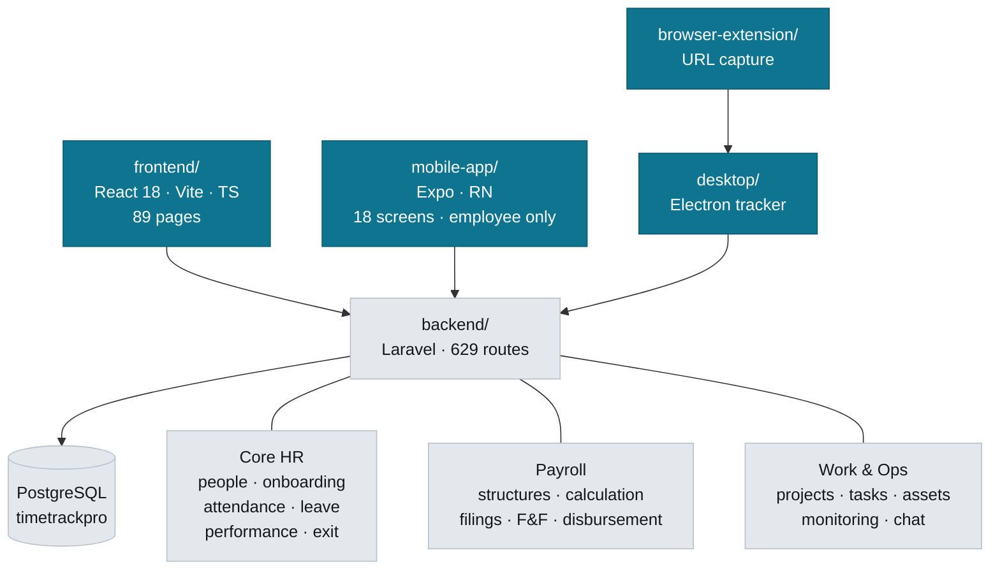

# CareVance HRMS

Multi-tenant HR and payroll platform for the Indian market. One Laravel API serving four clients.

---

## Navigation map



## Where things live

| Looking for | Go to |
|---|---|
| An API endpoint | `backend/routes/api/protected/*.php` — split by domain (`payroll.php`, `lifecycle.php`, `users.php`) |
| Business logic | `backend/app/Services/` — 82 services; controllers stay thin-ish |
| A web screen | `frontend/src/pages/` · shared UI in `components/` · domain UI in `features/` |
| API client calls | `frontend/src/services/api.ts` (large — one export per domain) |
| A mobile screen | `mobile-app/app/` (expo-router) · API in `mobile-app/src/api/endpoints.ts` |
| Tracker/screenshot logic | `desktop/main.cjs` |

### Commands

```bash
# backend  (cwd: backend/)
php artisan test                      # 505 tests, ~52 known failures
php artisan test --filter=SomeTest
php artisan migrate

# frontend (cwd: frontend/)
npm run dev                           # :5173
npx vitest run                        # 499 tests, ~51 known failures
npx tsc --noEmit                      # must stay at 0 errors
```

Backend runs on `:8000`, frontend on `:5173`. Tests use in-memory SQLite; the app uses PostgreSQL.

### Testing from a phone or a second machine

Both dev servers bind to loopback by default, so nothing else on the network can reach them. To hand the app to a tester:

```bash
# frontend — vite.config.ts now sets host: true, so this is enough
npm run dev                      # then open http://<your-LAN-IP>:5173

# backend — only needed for the NATIVE mobile app, which calls the API
# directly rather than through Vite's proxy
php artisan serve --host=0.0.0.0 --port=8000
```

The web app needs no backend change: `runtimeConfig.ts` resolves a relative
`/api` and Vite proxies it from the dev machine. **Do not set `VITE_API_URL`**
unless the API is somewhere the browser genuinely cannot infer — hardcoding
localhost there sends every request to the *tester's own device*.

The Expo app auto-detects the LAN host from Metro, so it finds the API by
itself once the backend is on `0.0.0.0`.

---

## Rules that are not obvious

### Multi-tenancy is structural — keep it that way

97 models use `App\Traits\BelongsToOrganization`, which adds a global scope and stamps `organization_id` on create. **Do not hand-write `where('organization_id', ...)` in new code** — it is already applied.

Cross-tenant access must be explicit and greppable:

```php
Model::withoutOrganizationScope()   // super admin, console commands
Model::forOrganization($id)         // pin to a known tenant
```

`tests/Feature/TenantIsolationTest.php` fails if a model owning a table with `organization_id` lacks the trait. If that test fails on a model you added, add the trait — do not add it to the exclusion list unless you can state why.

Excluded on purpose: `User` (the scope resolves the acting user through Auth), `Organization`, `OrganizationStats`, `Invitation` (written before a user exists).

### The test suites have known failures — gate on new ones

Both suites carry a tail of pre-existing failures (~52 backend, ~51 frontend). **Never judge a change by the failure count** — compare failing test *names* against the committed baseline:

```bash
node scripts/ci/test-baseline.mjs --junit <report.xml> \
  --baseline .github/baselines/phpunit.txt --check --label phpunit
```

CI (`.github/workflows/tests.yml`) does exactly this and fails only on new names. If a change legitimately alters the set, regenerate with `--update` and commit the baseline.

### Money

- Amounts are `decimal`, never float. Round once, at the boundary.
- Statutory rules live in services, not inline: `PayrollCalculatorService`, `PTStateService`.
- Professional tax is **state-levied** — several states levy none. Never default a missing state to a real one; an unset state yields ₹0.
- Gratuity must go through `calculateGratuityForSettlement()` (five-year floor + statutory ceiling). The raw `calculateGratuityOnExit()` applies neither.
- Net pay is stored **signed**. Do not clamp a negative to zero — payroll validation is what should stop the run, and it can only do that if it can see the real number.

### Dates

Date-only columns cast as `'date:Y-m-d'`, not `'date'`. A plain `date` cast serializes as a UTC datetime, so a calendar date reaches the client a day early in any timezone ahead of UTC. This has bitten joining dates, checklist due dates and settlement dates.

In JSX, `·` in *text* renders as the literal characters — it is only an escape inside a JS string.

### Errors

No bare `catch {}`. Use `frontend/src/lib/reportSilentError.ts` where swallowing is genuinely right. Silent catches previously turned three separate failures into no-ops that looked like success.

---

## Domain notes

### Onboarding

Hiring opens a journey automatically (`UserController::openOnboardingJourney` → `OnboardingService::open`). An 18-step checklist spans day −14 to +90 across six owner roles (hr, employee, it, manager, finance, buddy) with blocking gates.

- Anchor due dates on a single resolved date; do not re-read `joining_date` off the model after save.
- Future joining dates are **valid** — pre-boarding is the normal path.
- A joiner reads their own journey via `GET /api/onboarding/my-journey`, and can complete only `owner_kind = 'employee'` items.

### Payroll

Run status: `draft → locked → approved → released → disbursed`.

Disbursement is `PayrollDisbursementService`: it creates a `BankTransferBatch`, writes a NEFT/RTGS CSV, and records every line. The bank's returned UTR is the only reference a statement reconciles against — never invent one locally. Unpayable people are **returned as exclusions, never silently dropped**.

Two payroll data models coexist. `payroll_monthly_runs` + `payroll_items` is correct. The legacy `payrolls` table (513 rows, all `gross_salary = 0`) is being retired — do not add to it.

### Filings

Generators produce real EPFO ECR and NSDL FVU formats. Statutory identifiers resolve through `User::statutoryId('pan'|'uan'|'esi')`, which reads the profile column *or* `employee_government_ids` — they live in both places. A filing must report `filing_ready: false` when the org has no PAN/TAN rather than emitting `PANINVALID` and claiming success.

---

## Known gaps

Real, and deliberately not yet built:

- **No queue.** Payroll, filings and bank files run inside the web request. One job exists in the whole app. This is the ceiling on customer size — a run for a few hundred employees will hit `max_execution_time` mid-payroll, which is the worst place to lose a request.
- **No MFA and no SSO/SAML.** Google OAuth is the only federated option; a grep for `two_factor`/`totp`/`mfa`/`saml` returns nothing. This is the gate on any enterprise deal.
- **No legal-entity layer.** One organization = one PAN/TAN/PF code.
- **No offer letter, e-signature or background verification.**
- **No recruitment/ATS, engagement surveys, or HR helpdesk.** No job, candidate, interview or offer models exist. This is most of what a Keka comparison turns on.
- **No effective-dated compensation**, so retro/arrears across a revision is approximate.
- **Leave is a flat annual quota**, held as JSON in `organizations.settings` (`LeavePolicyService`). No accrual schedule, no pro-rating for mid-year joiners, no configurable leave year, no per-type carry-forward caps.
- **Mobile is employee-only** — no tasks, projects, chat, performance or resignation. No manager approvals, which is the most-used mobile workflow in every competing product.
- **0 policies.** Authorization is inline in controllers.
- **No real-time transport.** `BROADCAST_CONNECTION=log`; chat polls every 10s.

### Payroll paths whose state is genuinely unknown

`PayrollIntegrationTest` fails on F&F settlement, arrear payment, leave encashment and bank file generation with **422** — the routes exist and validation rejects the payload. The cause was not determined, so it is not known whether these features work. Treat them as unverified rather than working.

Distinguish this from `SimplePayrollFlowTest`, which fails with **405/404**: those tests target the retired `PayRun` API (`POST /api/payroll/runs/generate` no longer exists) and are dead weight in the baseline. **Check the status code before reading a failing payroll test** — 405 means delete it, 422 means investigate.

What *is* covered and passing: `PayrollDisbursementTest`, `PayrollReadinessTest` and `PayrollRouteAuthorizationTest` — 17 tests over disbursement idempotency, RTGS routing, exclusions-not-drops, UTR recording, PAN/IFSC validation and role-gating on every payroll route. The guardrails are tested; the generate → approve → payslip flow is not.

## Watch out for

- `desktop/release-*/` holds ~5 GB of build output; `.git` is ~2.9 GB from artifacts committed before the ignore rule existed.
- **There is one invite system now: `invitations`.** The legacy `invites` table and its routes were removed in Aug 2026 — the accept path resolved the invited address with an unscoped `User::query()` and overwrote the password of any account already holding it, in any organization. Do not reintroduce it. All four Add User tabs route through `invitations`, except **Create User**, which posts to `/users` with an admin-set password and is verified on create.
- **Create User depends on its Temporary Password field.** `POST /users` mints `Str::random(12)` when no password is supplied and sends no verification mail, so an admin-created user with neither a password nor `email_verified_at` cannot sign in at all. `UserController::store` sets `email_verified_at` only when a password was explicitly supplied — keep those two facts together if you touch either.
- Departments include both "HR" and "Human Resources" — duplicates that split every department-scoped report.
- Schema has drifted from migrations before (`bank_transfer_batches`). If tests fail on a missing column that exists in Postgres, suspect drift and write a guarded reconcile migration rather than editing an old one.
