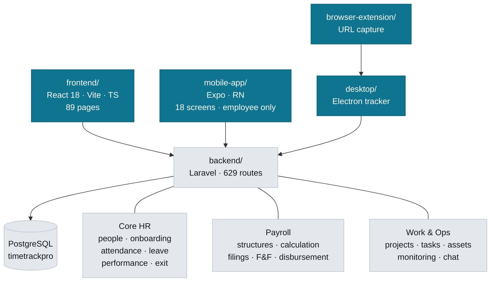

# CareVance HRMS

Multi-tenant HR and payroll platform for the Indian market. One Laravel API serving four clients.

---

## Navigation map



## Where things live

| Looking for | Go to |
|---|---|
| An API endpoint | `backend/routes/api/protected/*.php` — split by domain (`payroll.php`, `lifecycle.php`, `users.php`) |
| Business logic | `backend/app/Services/` — 82 services; controllers stay thin-ish |
| A web screen | `frontend/src/pages/` · shared UI in `components/` · domain UI in `features/` |
| API client calls | `frontend/src/services/api.ts` (large — one export per domain) |
| A mobile screen | `mobile-app/app/` (expo-router) · API in `mobile-app/src/api/endpoints.ts` |
| Tracker/screenshot logic | `desktop/main.cjs` |

### Commands

```bash
# backend  (cwd: backend/)
php artisan test                      # 1761 tests, all passing
php artisan test --filter=SomeTest
php artisan migrate

# frontend (cwd: frontend/)
npm run dev                           # :5173
npx vitest run                        # 1244 tests, 34 known failures
npx tsc --noEmit                      # must stay at 0 errors
```

```bash
# mobile   (cwd: mobile-app/)
npx jest                              # 60 tests, all passing
npx tsc --noEmit                      # must stay at 0 errors
npx expo start --go                   # Expo Go; --clear to drop Metro's cache
```

Backend runs on `:8000`, frontend on `:5173`. Tests use in-memory SQLite; the app uses PostgreSQL.

### Testing from a phone or a second machine

Both dev servers bind to loopback by default, so nothing else on the network can reach them. To hand the app to a tester:

```bash
# frontend — vite.config.ts now sets host: true, so this is enough
npm run dev                      # then open http://<your-LAN-IP>:5173

# backend — only needed for the NATIVE mobile app, which calls the API
# directly rather than through Vite's proxy
php artisan serve --host=0.0.0.0 --port=8000
```

The web app needs no backend change: `runtimeConfig.ts` resolves a relative
`/api` and Vite proxies it from the dev machine. **Do not set `VITE_API_URL`**
unless the API is somewhere the browser genuinely cannot infer — hardcoding
localhost there sends every request to the *tester's own device*.

The Expo app auto-detects the LAN host from Metro, so it finds the API by
itself once the backend is on `0.0.0.0`.

---

## Rules that are not obvious

### Multi-tenancy is structural — keep it that way

97 models use `App\Traits\BelongsToOrganization`, which adds a global scope and stamps `organization_id` on create. **Do not hand-write `where('organization_id', ...)` in new code** — it is already applied.

Cross-tenant access must be explicit and greppable:

```php
Model::withoutOrganizationScope()   // super admin, console commands
Model::forOrganization($id)         // pin to a known tenant
```

`tests/Feature/TenantIsolationTest.php` fails if a model owning a table with `organization_id` lacks the trait. If that test fails on a model you added, add the trait — do not add it to the exclusion list unless you can state why.

Excluded on purpose: `User` (the scope resolves the acting user through Auth), `Organization`, `OrganizationStats`, `Invitation` (written before a user exists).

### The test suites have known failures — gate on new ones

The frontend still carries a tail of pre-existing failures (34); **the backend
baseline is now empty — every backend test passes.** Either way, **never judge a
change by the failure count** — compare failing test *names* against the
committed baseline:

```bash
node scripts/ci/test-baseline.mjs --junit <report.xml> \
  --baseline .github/baselines/phpunit.txt --check --label phpunit
```

CI (`.github/workflows/tests.yml`) does exactly this and fails only on new names. If a change legitimately alters the set, regenerate with `--update` and commit the baseline.

### Money

- Amounts are `decimal`, never float. Round once, at the boundary.
- Statutory rules live in services, not inline: `PayrollCalculatorService`, `PTStateService`.
- Professional tax is **state-levied** — several states levy none. Never default a missing state to a real one; an unset state yields ₹0.
- Gratuity must go through `calculateGratuityForSettlement()` (five-year floor + statutory ceiling). The raw `calculateGratuityOnExit()` applies neither.
- Net pay is stored **signed**. Do not clamp a negative to zero — payroll validation is what should stop the run, and it can only do that if it can see the real number.

### Dates

Date-only columns cast as `'date:Y-m-d'`, not `'date'`. A plain `date` cast serializes as a UTC datetime, so a calendar date reaches the client a day early in any timezone ahead of UTC. This has bitten joining dates, checklist due dates and settlement dates.

In JSX, `·` in *text* renders as the literal characters — it is only an escape inside a JS string.

### Errors

No bare `catch {}`. Use `frontend/src/lib/reportSilentError.ts` where swallowing is genuinely right. Silent catches previously turned three separate failures into no-ops that looked like success.

---

## Domain notes

### Onboarding

Hiring opens a journey automatically (`UserController::openOnboardingJourney` → `OnboardingService::open`). An 18-step checklist spans day −14 to +90 across six owner roles (hr, employee, it, manager, finance, buddy) with blocking gates.

- Anchor due dates on a single resolved date; do not re-read `joining_date` off the model after save.
- Future joining dates are **valid** — pre-boarding is the normal path.
- A joiner reads their own journey via `GET /api/onboarding/my-journey`, and can complete only `owner_kind = 'employee'` items.

### Payroll

Run status: `draft → locked → approved → released → disbursed`.

Disbursement is `PayrollDisbursementService`: it creates a `BankTransferBatch`, writes a NEFT/RTGS CSV, and records every line. The bank's returned UTR is the only reference a statement reconciles against — never invent one locally. Unpayable people are **returned as exclusions, never silently dropped**.

Two payroll data models coexist. `payroll_monthly_runs` + `payroll_items` is correct. The legacy `payrolls` table (513 rows, all `gross_salary = 0`) is being retired — do not add to it.

### Filings

Generators produce real EPFO ECR and NSDL FVU formats. Statutory identifiers resolve through `User::statutoryId('pan'|'uan'|'esi')`, which reads the profile column *or* `employee_government_ids` — they live in both places. A filing must report `filing_ready: false` when the org has no PAN/TAN rather than emitting `PANINVALID` and claiming success.

---

## Known gaps

Real, and deliberately not yet built:

> **Keep this list honest in both directions.** It was audited on 19 Aug 2026
> and three entries were found to be describing work that had since been built
> — effective-dated compensation, shift definitions and mobile approvals. A
> stale gap list is not harmless: technical buyers read it and believe it, and
> it cost real marks in a customer evaluation for features that already
> shipped. When you close a gap, delete the line in the same commit.

- **Ten filing generators have no blade view** — `form1`, `form2`, `form6`, `form19`, `form31`, `form124`, `eshram_registration`, `se_registration`, `shram_card_registration`, `uan_activation`. Only `form12ba`, `form16` and `form16_annual` exist under `resources/views/filings/`. `FilingGeneratorRegistry` resolves availability from the filesystem, so these are now reported as *unavailable* rather than attempted and failed — writing a template is the whole act of shipping its filing. This is real statutory work, not a stub.
- **No SSO/SAML and no SCIM.** MFA now exists (TOTP + recovery codes, see `MfaService`), but Google OAuth is still the only federated option. This is the gate on any deal above ~500 seats.
- **No legal-entity layer.** One organization = one PAN/TAN/PF code. Most Indian mid-market groups run two to four entities, so this disqualifies the product before a demo rather than merely losing marks.
- **No offer letter, e-signature or background verification.**
- **No recruitment/ATS, engagement surveys, or HR helpdesk.** No job, candidate, interview or offer models exist. This is most of what a Keka comparison turns on.
- **Leave is a flat annual quota**, held as JSON in `organizations.settings` (`LeavePolicyService`). No accrual schedule, no pro-rating for mid-year joiners, no configurable leave year, no per-type carry-forward caps. Every customer has mid-year joiners, so this one is universal.
- **No date-based rostering.** Shift *definitions* exist and are real — `Shift` carries night-shift windows, differentials, overtime multipliers and grace periods, and `employee_shifts` assigns them. What is missing is the calendar: rotation patterns, published rosters by date, week-off calendars and swap requests.
- **No biometric device ingestion.** eSSL, ZKTeco and Matrix punch devices are on the wall of most Indian offices and none of them can talk to this.
- **No accounting export.** `GlMappingConfig` exists with nothing to export to — no Tally, no Zoho Books.
- **English only.** No i18n layer of any kind, which caps self-service adoption on a shop floor.
- **0 Laravel policies.** Authorization is inline in controllers, though the `Role`/`Permission` schema and `hasPermission()` are real and maker-checker now covers the full payroll chain.
- **No real-time transport.** `BROADCAST_CONNECTION=log`; chat polls every 10s.
- **One error boundary for the whole app.** See `frontend/src/main.tsx`.

### Not gaps — these were on this list and are built

Kept visible rather than deleted, because they were wrongly believed missing:

- **Effective-dated compensation is implemented.** `Services/Payroll/CompensationTimeline` resolves what somebody earned on any given day from accepted revision letters, and `PayrollAutoProcessService` calls `blendedAnnualCtcForMonth()`. A mid-month revision blends correctly and a back-dated one diffs against a real prior rate — arrears are not "approximate".
- **Mobile has manager approvals.** `mobile-app/app/approval-inbox/`, plus team, notification publishing, comp-off, regularisation and selfie attendance across 18 screens.
- **Shift definitions exist** — see the rostering entry above for what actually remains.

### The queue, and the worker you must actually run

`POST /payroll/runs/{id}/process-remaining` no longer processes employees inline. It marks the run `queued`, dispatches `ProcessPayrollRunEmployees`, and returns **202** with a progress handle; the client polls `GET /payroll/runs/{id}/processing-status` until `processing.is_finished`.

**`.env.example` sets `QUEUE_CONNECTION=database`, so a deployment that follows it needs a worker running or payroll processing will queue and never happen:**

```bash
php artisan queue:work --queue=default --tries=1 --timeout=3600
```

Local `.env` files currently carry `QUEUE_CONNECTION=sync`, where the job runs inline on dispatch — same behaviour as before, and no worker needed. That is why the endpoint re-reads progress off the run before responding rather than assuming the work is still pending: the client polls the same fields under either driver and never needs to know which is configured.

### The scheduler, and the timers that never close without it

Same trap, different process. `routes/console.php` schedules `timers:close-idle` **every minute** as the server-side backstop for desktop idle detection, plus `timers:close-stale`, the screenshot purge and the lifecycle sweep. None of it runs unless something drives the schedule:

```bash
php artisan schedule:work          # dev
# production: a cron / Scheduled Task calling `schedule:run` every minute
```

Without it the only thing that can stop an idle timer is the desktop app itself, which cannot act once it is closed, asleep or crashed. Measured 17 Aug 2026 with no scheduler running: `time_entries` #2114 started 17:59 and was still open at midday the next day.

Money stays correct either way — every auto-stop path rewinds `end_time` to the last real activity and records the idle tail in `trailing_idle_seconds`, so a late stop never bills the idle. What breaks is the timer appearing to run all night.

`POST /payroll/filings/generate/all` works the same way through `GenerateRunFilings`, and its progress appears under `filings` on the same status endpoint. **The bank file is deliberately still synchronous** — one eager-loaded query plus string formatting, returning content the user is waiting to download. Queueing it would turn a one-click download into prepare-poll-download for no gain.

`PayrollFilingService::generateAllFilings()` returns `['filings' => [...], 'failures' => [...]]` and attempts each generator independently. It used to be an unguarded sequence, so the first throw ended the batch — and because ten declaration-form generators reference missing views, `generateForm19()` reliably killed the run *after* PF ECR, ESI, 24Q and 12BA had already been written, leaving a 500 and no report. An `InvalidArgumentException` from a generator means "not due this period" and is a skip, not a failure.

Two things about these jobs are load-bearing:

- **It authenticates as the user who started it.** `BelongsToOrganization`'s global scope reads the organization from the authenticated user, and with *no* user it is deliberately a no-op so console commands are not filtered to nothing. In a queued job that default means querying **across every tenant**. Any new job touching scoped models must do the same — `Auth::setUser($actor)` — and `PayrollRunProcessingQueueTest` asserts it.
- **`tries = 1`.** A retry would re-enter a partially processed run and race the first attempt. Failures are recorded on the run for a human, not retried silently.

A second start while one is in flight is refused with **409** rather than queued — two workers walking the same missing list would race to create the same payroll item.

### Reading a failing payroll test

**Check the status code before you read the test.** The two failure modes mean opposite things:

- **405/404 — the test is dead.** `SimplePayrollFlowTest` targets the retired `PayRun` API (`POST /api/payroll/runs/generate` no longer exists). Delete it rather than debug it.
- **422 — a guard is refusing an incomplete fixture.** Every one of these in `PayrollIntegrationTest` turned out to be correct business logic, not a defect. Capture the response body first; the messages name exactly what is missing.

The four guards worth knowing, because new payroll tests keep tripping them:

| Operation | Requires first |
|---|---|
| F&F settlement, leave encashment | `annual_ctc` on the employee's payroll template — both compute every figure from it |
| Arrear **approval** | A run *and* a `payroll_item` for the arrear's `calculation_month` |
| Bank file | The run to have cleared `draft → locked → approved` |

`payroll/employees/{id}` is an HR/admin view. Employees reach their own figures through `payroll/my/*` — see the allow-list in `PayrollRouteAuthorizationTest`.

Covered and passing: `PayrollIntegrationTest` (15), plus `PayrollDisbursementTest`, `PayrollReadinessTest` and `PayrollRouteAuthorizationTest` (17) over disbursement idempotency, RTGS routing, exclusions-not-drops, UTR recording, PAN/IFSC validation and role-gating on every payroll route.

## Watch out for

- `desktop/release-*/` holds ~5 GB of build output; `.git` is ~2.9 GB from artifacts committed before the ignore rule existed.
- **There is one invite system now: `invitations`.** The legacy `invites` table and its routes were removed in Aug 2026 — the accept path resolved the invited address with an unscoped `User::query()` and overwrote the password of any account already holding it, in any organization. Do not reintroduce it. All four Add User tabs route through `invitations`, except **Create User**, which posts to `/users` with an admin-set password and is verified on create.
- **Create User depends on its Temporary Password field.** `POST /users` mints `Str::random(12)` when no password is supplied and sends no verification mail, so an admin-created user with neither a password nor `email_verified_at` cannot sign in at all. `UserController::store` sets `email_verified_at` only when a password was explicitly supplied — keep those two facts together if you touch either.
- Departments include both "HR" and "Human Resources" — duplicates that split every department-scoped report.
- Schema has drifted from migrations before (`bank_transfer_batches`). If tests fail on a missing column that exists in Postgres, suspect drift and write a guarded reconcile migration rather than editing an old one.
